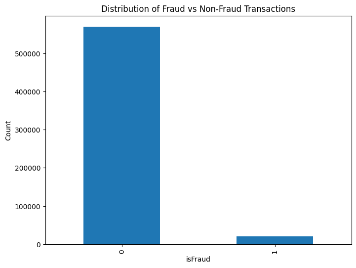
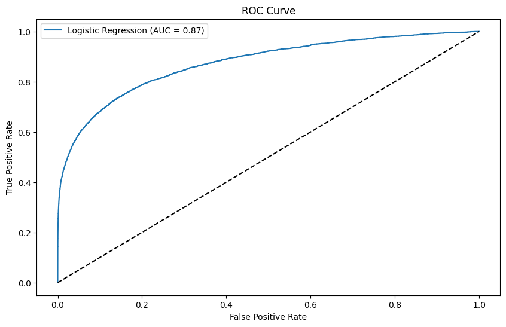
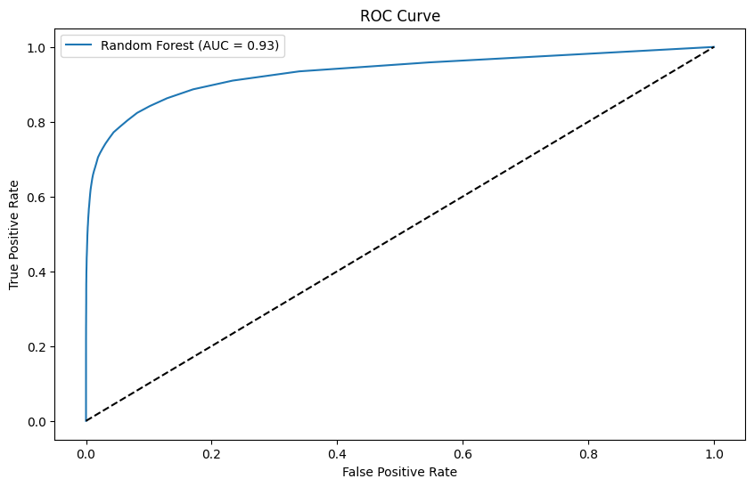
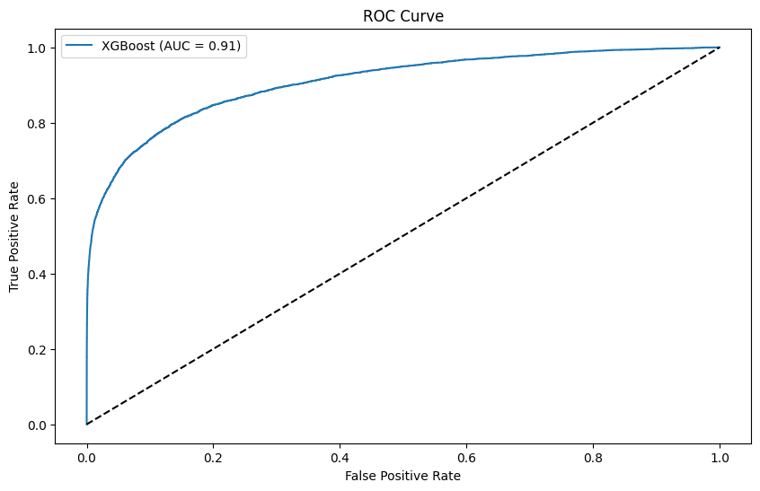
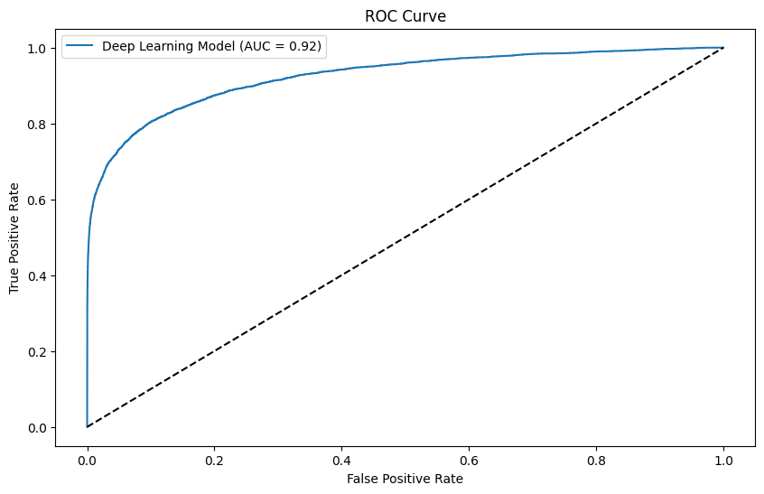

# Fraud detection solution using AI and machine learning

The goal of this project is to develop a robust fraud detection system that can accurately identify fraudulent transactions . The system leverages machine learning and deep learning techniques to achieve high performance, especially in the context of imbalanced datasets typical in fraud detection scenarios.

## Objectives

-  To address the challenges posed by the significant class imbalance between fraudulent and non-fraudulent transactions through advanced data preprocessing, model selection, and threshold tuning techniques.

- To experiment with and optimize various machine learning models, including Random Forest, Gradient Boosting, and Deep Learning, to achieve the highest possible predictive performance (ROC AUC).

- To experiment with different classification thresholds to find the optimal balance between precision (minimizing false positives) and recall (maximizing fraud detection).
## Dataset

Source: Kaggle - [IEEE-CIS Fraud Detection Dataset](https://www.kaggle.com/c/ieee-fraud-detection)

Files Used:

- train_transaction.csv: Transactional data including features like TransactionDT, TransactionAmt, and ProductCD.
- train_identity.csv: Identity data associated with transactions, including features like DeviceType and DeviceInfo.
- test_transaction.csv and test_identity.csv: Corresponding test datasets.

Target Variable: isFraud (binary indicator: 1 for fraud, 0 for non-fraud)
## Data Exploration

**Label Distribution**

- The distribution is highly imbalanced, with a significantly larger number of non-fraud transactions (represented by "0" on the x-axis) compared to fraud transactions (represented by "1"). This imbalance is a common challenge in fraud detection datasets.

- The bar corresponding to non-fraud transactions is much taller, visually emphasizing its dominance in the dataset.

- F1-score are more suitable for evaluating the model's performance on the minority class.
## Model Performance

***Logistic Regression***

| Class | Precision | Recall | F1-Score | Support |
|-------|-----------|--------|----------|---------|
| 0     | 0.97      | 1.00   | 0.99     | 113866  |
| 1     | 0.85      | 0.29   | 0.44     | 4242    |
| Accuracy |         |        | 0.97     | 118108  |
| Macro Avg | 0.91   | 0.65   | 0.71     | 118108  |
| Weighted Avg | 0.97 | 0.97  | 0.97     | 118108  |

Logistic Regression ROC AUC: 0.8742852391082819

***Random Forest***

| Class | Precision | Recall | F1-Score | Support |
|-------|-----------|--------|----------|---------|
| 0     | 0.98      | 1.00   | 0.99     | 113866  |
| 1     | 0.95      | 0.41   | 0.57     | 4242    |
| Accuracy |         |        | 0.98     | 118108  |
| Macro Avg | 0.97   | 0.70   | 0.78     | 118108  |
| Weighted Avg | 0.98 | 0.98  | 0.97     | 118108  |

Random Forest ROC AUC: 0.9309374755522329

***xgboost***

| Class | Precision | Recall | F1-Score | Support |
|-------|-----------|--------|----------|---------|
| 0     | 0.98      | 1.00   | 0.99     | 113866  |
| 1     | 0.77      | 0.46   | 0.57     | 4242    |
| Accuracy |         |        | 0.98     | 118108  |
| Macro Avg | 0.88   | 0.73   | 0.78     | 118108  |
| Weighted Avg | 0.97 | 0.98  | 0.97     | 118108  |

XGBoost ROC AUC: 0.9077410697552437

***Deep Learning Model***

| Class | Precision | Recall | F1-Score | Support |
|-------|-----------|--------|----------|---------|
| 0     | 0.98      | 1.00   | 0.99     | 113866  |
| 1     | 0.84      | 0.52   | 0.64     | 4242    |
| Accuracy |         |        | 0.98     | 118108  |
| Macro Avg | 0.91   | 0.76   | 0.82     | 118108  |
| Weighted Avg | 0.98 | 0.98  | 0.98     | 118108  |

Deep Learning Model ROC AUC: 0.9246724613055639

## Conclusion

The deep learning  model achieved an AUC of 0.92 and F1-score of 0.82 , demonstrating strong performance in detecting fraudulent transactions.
